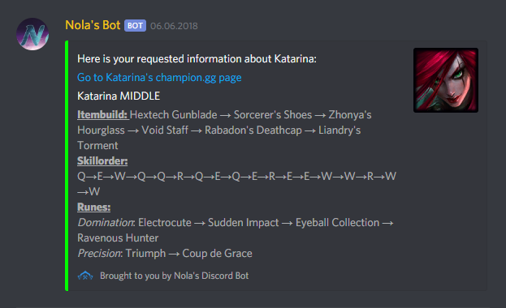
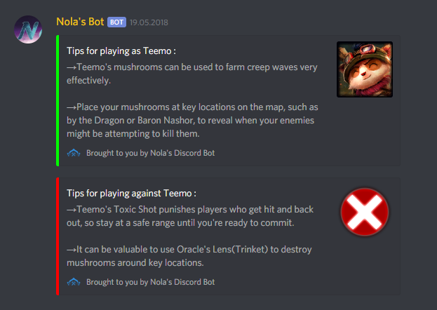

# Nolas Discord Bot
This is a bot for the popular voice- and chat platform Discord. Its main purpose is to help players new to League of Legends get an idea of which items to buy and which runes to use on their champions.
You can run it on a server (preferred) or locally on your machine whenever you need it

This is a project intended for private use by myself. It has not been optimized to be used by other people. 

## Requirements and setup
Java 8 or higher

API Key for the Riot Api and the champion.gg API

Create a "Bot user" on [the Discord developer page](https://discordapp.com/developers/applications/) and copy your token to the settings.properties

Invite your "Bot user" to your Discord server. Make sure you give it permission to use embedded messages.

You need a server to run it on - or run it locally on your machine.

## Commands

**Commands that work for everyone on your Discord server:**

* !champ [championName]

This command will give you item and rune suggestions based on what's currently popular for that champion. The bot will send one message per role (ADC, MID, TOP, JUNGLE, SUPPORT) where this champion is often played.

* !champ [championName] [championRole]

Same as above, but filtered to only give suggestions for the specific role (ADC, MID, TOP, JUNGLE, SUPPORT). The bot will respond with an error message if no data could be found for the champion in that role.

* !champ

Use this if you are registered with the bot and are currently in a game with the champion you want to receive build and rune suggestions to.

* !champ [championRole]

Use this if you are registered with the bot and are currently in a game with the champion you want to receive build and rune suggestions to, for a certain role (ADC, MID, TOP, JUNGLE, SUPPORT).

Example of what the bot's answer looks like:

* !register [summonerName]

If you want to use !champ and !tips without needing to provide a championname, you need to register with this command first. The bot will then save your discord-user-id, your summonername and your League of Legends account id (which it retrieves automatically). Afterwards, you can use !champ or !tips without extra parameters to get infos to the champion you are currently in a game as.

* !deleteMyData

Deletes your Discord and League of Legends data from the summoners.txt file

* !tips [championName]

Gives you some tips on how to play **as** or **against** the given champion.

* !tips

Use this if you are registered with the bot and are currently in a game with the champion you want to receive tips to.

Example of what the bot's answer looks like:

**Commands that only work if you're the bot's owner:**

* !reloadCache

Loads the current values for the API keys from the property file.

* !get

Sends you all properties and their values as a private message

* !get [propertyName]

Sends you a specific property's value as a private message

* !set [propertyName] [propertyValue]

Sets that specific property's value. Sets it to empty if no value given. Will fail if property with given name doesn't exist.

## Work in progress
Your api keys were formally stored in src/main/resources/keys.txt. This has been moved to settings.properties in the same folder.

Similar thing applies to the Discord Bot User token. This has been moved to the properties file as well. 

The code has not yet been fully updated to deal with these changes. The !get and !set commands are also not yet working.

## Known Problems
Since I started restructuring the way API Keys/the token are stored and read and haven't had time to finish that, it's broken right now

## Future Plans 
* The reloadCache command should also renew the data for champions and items